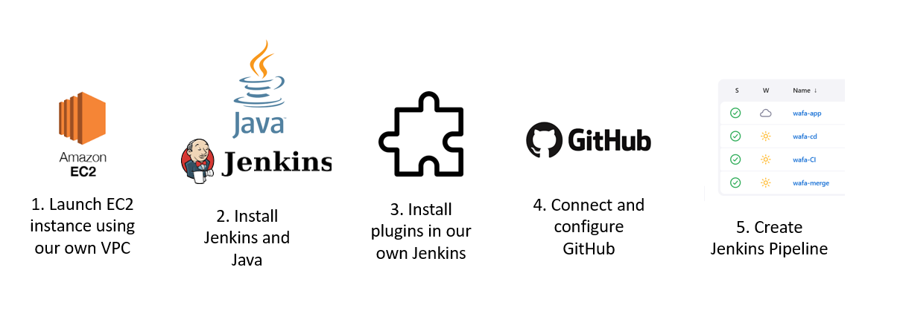
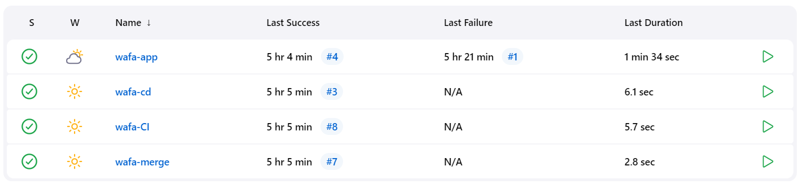

## Creating our owm Jenkins 

Diagram


#### Launching Instance
1. Create own instance
2. Select Ubuntu 20.04 lts AMI
3. Select your own VPC 
4. Select your own Security rules
   5. Include port 8080 for Jenkins
6. Launch Instance
7. SSH into Instance via Gitbash inside .ssh folder
8. Once logged in, install Java using following commands:
```commandline
sudo apt update

sudo apt install default-jdk

java -version
```

9. Run commands in Order to install Jenkins:
```commandline
wget -q -O - https://pkg.jenkins.io/debian-stable/jenkins.io.key | sudo apt-key add -

sudo sh -c 'echo deb https://pkg.jenkins.io/debian-stable binary/ > /etc/apt/sources.list.d/jenkins.list'

sudo apt-key adv --keyserver keyserver.ubuntu.com --recv-keys 5BA31D57EF5975CA

sudo apt-get update

sudo apt install jenkins
```
10. To get the Jenkins Password, Run Command:
```commandline
sudo cat /var/lib/jenkins/secrets/initialAdminPassword
```
Copy the password.

11. Copy Public IP Address from your instance and paste this is a browser with the Jenkins port 8080
`IP-Address:8080`
12. When instructed, paste the administrator password into Jenkins
13. Select **Install suggested Plugins** and wait for this to install
14. After this has finished, skip the username creation and Finish.

#### Install Required Plugins:
15. Go to **Manage Jenkins**
16. Click Plugins 
17. Click **Available plugins**
18. Search for **SSH Agent** and **Office 365 Connector** and **NodeJS**
19. After plugins are successful, return to the Gitbash and copy and paste the commands:
```commandline
sudo su - jenkins
ssh-keyscan github.com >> ~/.ssh/known_hosts
```
### 2. Creating a first job
1. New item
2. Name this `wafa-CI`

```commandline
cd app/app
npm install
npm test
```

### 2. Creating a second job

1. Click **New Item**
2. Enter a suitable name: `wafa-merge` > freestyle project
3. Scroll down and click **OK**
4. Write a description (can be anything suitable)
5. Select **Discard old builds**
6. Max # of builds to keep = 5
6. Tick **GitHub Projects** > `https://github.com/WafaMohbubul/CI_CD/`
6. Office 365 > Blank
7. Source Code Management > Git > Paste GitHub SSH link `git@github.com:WafaMohbubul/CI_CD.git`
9. Credentials > `wafa-jenkins-key4`
10. Branch specifier = `*/dev`
11. Add Additional Behaviours > Merge before Build 
    12. Name of Repository = `origin`
    13. Branch to merge = `main`
11. Build Triggers > Tick **Build after other projects are built** > Projects to watch: `wafa-CI` > Trigger only if build is stable
11. Build Triggers > Tick **GitHub hook trigger for GITcm polling**
12. Build Environment > Provide Node & npm bin/ folder to PATH = `Sparta-nodejs`
12. Build Environment > SSH Agent: `tech254-1.pem`
13. Post-build Actions > Git Publisher:
    14. Push Only If Build Succeeds
    15. Merge Results

### 3. Creating a third job

#### Task 3.1: New Instance
1. Launch a new instance in AWS
2. Use AMI Ubunutu 20.04 lts
3. Use your 

#### Task 3.2: Create the third job
1. Click **New Item**
2. Enter a suitable name: `wafa-cd` > freestyle project
3. Scroll down and click **OK**
4. Write a description (can be anything suitable)
5. Select **Discard old builds**
6. Max # of builds to keep = 5
6. Tick **GitHub Projects** > `https://github.com/WafaMohbubul/CI_CD/`
6. Office 365 > Blank
7. Source Code Management > Git > Paste GitHub SSH link `git@github.com:WafaMohbubul/CI_CD.git`
9. Credentials > `wafa-jenkins-key4`
10. Branch specifier = `*/main`
11. Build Triggers > Tick **Build after other projects are built** > Projects to watch: `wafa-merge`
11. Build Triggers > Tick **GitHub hook trigger for GITcm polling**
12. Build Environment > Provide Node & npm bin/ folder to PATH = `Sparta-nodejs`
12. Build Environment > SSH Agent: `tech254-1.pem`
13. Built > Execute Shell:

```commandline
rsync -avz -e "ssh -o StrictHostKeyChecking=no" app ubuntu@34.244.143.41:/home/ubuntu
ssh -o "StrictHostKeyChecking=no" ubuntu@34.244.143.41 <<EOF

    sudo apt-get update -y
    sudo apt-get upgrade -y
    sudo apt-get install nginx -y
    sudo systemctl restart nginx
    sudo systemctl enable nginx
EOF
```
NOTE: THE IP ADDRESS OF THE NEW INSTANCE CREATED

### 4. Creating a 4th job
1. Click **New Item**
2. Enter a suitable name: `wafa-app` > freestyle project
3. Scroll down and click **OK**
4. Write a description (can be anything suitable)
5. Select **Discard old builds**
6. Max # of builds to keep = 5
6. Tick **GitHub Projects** > `https://github.com/WafaMohbubul/CI_CD/`
6. Office 365 > Blank
7. Source Code Management > Git > Paste GitHub SSH link `git@github.com:WafaMohbubul/CI_CD.git`
9. Credentials > `wafa-jenkins-key4`
10. Branch specifier = `*/main`
11. Build Triggers > Tick **Build after other projects are built** > Projects to watch: `wafa-cd`
11. Build Triggers > Tick **GitHub hook trigger for GITcm polling**
12. Build Environment > Provide Node & npm bin/ folder to PATH = `Sparta-nodejs`
12. Build Environment > SSH Agent: `tech254-1.pem`
13. Built  > Execute Shell:
```commandline
ssh -A -o "StrictHostKeyChecking=no" ubuntu@34.244.143.41 <<EOF

# install Node.js and npm
curl -sL https://deb.nodesource.com/setup_12.x | sudo -E bash -
sudo apt install nodejs -y

# install pm2 globally
sudo npm install pm2 -g

cd app/app

# install project dependencies
npm install

# start the node.js application
pm2 start  app.js
pm2 restart app.js
```
14. Click **Save**

### To check it works
1. Push something to GitHub
2. All the jobs should be triggered. And should have all passed as seen below

